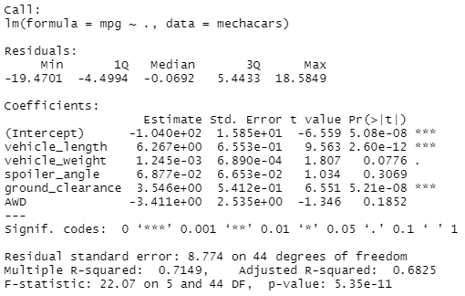
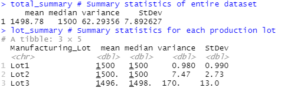
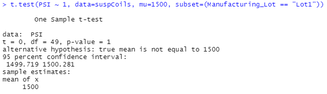
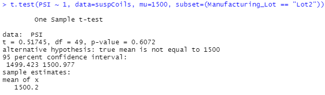
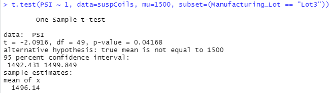

# MechaCar Statistical Analysis

From the challenge,  
A few weeks after starting his new role, Jeremy is approached by upper management about a special project. AutosRUs’ newest prototype, the MechaCar, is suffering from production troubles that are blocking the manufacturing team’s progress. AutosRUs’ upper management has called on Jeremy and the data analytics team to review the production data for insights that may help the manufacturing team.

In this challenge, you’ll help Jeremy and the data analytics team do the following:
* Perform multiple linear regression analysis to identify which variables in the dataset predict the mpg of MechaCar prototypes.
* Collect summary statistics on the pounds per square inch (PSI) of the suspension coils from the manufacturing lots.
* Run t-tests to determine if the manufacturing lots are statistically different from the mean population.
* Design a statistical study to compare vehicle performance of the MechaCar vehicles against vehicles from other manufacturers. For each statistical analysis, you’ll write a summary interpretation of the findings.

 

## Linear Regression to Predict MPG

In the provided dataset, `MechaCar_mpg.csv`, there are six columns of data. To predict the gas mileage of the MechaCars, we take one column to be an indepedent variable, the miles per gallon value `mpg`, and five to be dependent variables:
* `vehicle_length`: A measure of the length of the MechaCar, likely in feet;
* `vehicle_weight`: A measure of the weight of the MechaCar, likely in pounds;
* `spoiler_angle`: A measure of the angle between the spoiler the MechaCar body, in degrees;
* `ground_clearance`: A measure of how high the MechaCar sits above the roadway, likely in inches; and
* `AWD`: A true-false value, either 1 or 0, to indicate whether the MechaCar is all wheel drive or not.
 

Using the native R function `lm()`, we find the following relationship between the gas mileage and depedent variables,  
`MPG = 6.27*vehicle_length + 0.001*vehicle_weight + 0.069*spoiler_angle + 3.55*ground_clearance - 3.41*AWD - 104`  

A printout of the `lm()` results,  
  

The overall p-value of the model is 5.4e-11 (i.e. 0.0000000054%), strongly suggesting the MechaCar gas mileage is dependent in some way on the dependent variables above (the null hypothesis would be there is no correlation between the dependent variables and the gas mileage).  

For each depedent variable, there is a null hypothesis that the dependent variable has no effect on the gas mileage, which is to say the coefficient would be 0. The p-value provided by `lm()` for each variable tests this hypothesis. At a typical significance level of 0.05 for the p-value, there are three fit coefficients to discuss:  
* `vehicle_length` has a p-value of 2.6e-12. Effectively zero, we reject the null hypothesis and suggest the length of the MechaCar heavily affects the gas mileage.
* `ground_clearance` has a p-value of 5.2e-8. Also very close to zero, we reject the null hypothesis and suggest the clearance of the MechaCar to the ground heavily effects the gas mileage. 
* The `lm()` fit intercept has a p-value of 5.1e-8, actually smaller than that of the clearance variable. Rejecting the null hypothesis for the intercept necessitates positing there are unknown, untested factors that influence the MechaCar gas mileage. Such factors could include the engine capacity or number of engine cylinders. Without that data, however, there is little more to be said than go collect that data for future analyses.  

For the remaining three dependent variables, we fail to reject the null hypothesis. On the other hand, `vehicle_weight` has a p-value around 7.8%, right near the cusp of the significance level, and further investigation of this variable is warranted along with the unknown variables mentioned in the preceding paragraph.

The `lm()` model results give an R2 value of 0.71. Additionally, the residual standard error is around 8.8 (around only half of the standard deviation of the entire mpg dataset, 15.6). Combined with the intercept's p-value discussion above, we are hesistant to suggest the fit based on these five dependent variables accurately predicts each MechaCar's gas mileage. 

 

## Summary Statistics on Suspension Coils

Each MechaCar is built with a suspension coil, which is supposed to be set to 1500 PSI. The datafile `Suspension_Coil.csv` contains suspension coil pressures for 150 MechaCars across three production lots. Summary statistics are provided below for the entire dataset and each production lot,  
  

In table form to consistent decimal confidence,  
| Prod. Lot | Mean | Median | Var. | St. Dev. |
| --------- | ---- | ------ | ---: | --------: |
| Overall | 1,498.8 | 1,500.0 | 62.3 | 7.9 |
| Lot1 | 1,500.0 | 1,500.0 | 1.0 | 1.0 |
| Lot2 | 1,500.2 | 1,500.0 | 7.5 | 2.7 |
| Lot3 | 1,496.1 | 1,498.5 | 170.3 | 13.0 |  

Design specifications require the variance of the suspension coils must not exceed 100 PSI. In summa, this requirement is satisfied, the variance is only 62.3 PSI. Breaking it down by production lot, however, shows us there is a problem with the production of Lot 3, in which the variance is 170 PSI, clearly beyond the limit of 100 PSI. Lots 1 & 2 show no such issues with variances of about 1 and 7.5 PSI, respectively.  

 

## T-Tests on Suspension Coils  

An alternate way of testing whether the suspension coils are in compliance with design specifications is to utilize the Student's t-test. We can compare the mean suspension coil pressure of a production lot to the expected mean, namely 1,500 PSI. In this case, the null hypothesis  would state there is no statistical difference between the production lot's suspension coils and the expected specification of 1,500 PSI, which is to say the coils are in compliance with the design specifications. Results of each t-test are below.

##### Overall production
  
The mean of the pressures is 1,498.8 PSI, just as above. To a nominal significance level of 5%, the p-value of 6.0% suggests a soft failure to reject the null hypothesis, meaning the suspension coils do meet design standards.  

##### Production Lot 1  
  
As above, the mean pressure for suspension coils produced in Lot 1 is 1,500 PSI. A p-value of 100.% suggests there is no statistical way in which the coils produced in Lot 1 do not meet the specifications of 1,500 PSI.

##### Production Lot 2  
  
Once again, the t-test reports the mean consistent with the table above with a pressure of 1,500.2 PSI. With a p-value around 61%, it is stastically fair to say the suspension coils of production lot 2 meet the design standards.  

##### Production Lot 3  
  
The calculated mean pressure at 1,496.1 PSI matches the reported values above. With a p-value of 4.2%, to the nominal 5% significance level, we reject the null hypothesis and suggest the coils produced in lot 3 do not statistically meet the design specification requried.

Overall, the Student's t-test has reaffirmed what was discussed in the preceding section. Of the entire set of suspension coils produced, the coils meet the design specification. Investigating the coils by production lot reveals that production lot 3 has muddled the overall results with poor production. The coils from lot 3 should be recalled and production methods examined more closely to find where the errors are introduced.

 

## Study Design: MechaCar vs Competition

Consumers have varying needs and wants for their cars that influence their purchasing decisions. For instance, a four-cylinder front-wheel drive sedan can be satisfactory for a city resident, whereas a six-cylinder all-wheel drive pickup truck could be preferable for a rural farmhand. Within those subdivisions of preferences, the consumer can want the best value of a metric, or even the best metric regardless of the price.

#### T-test example

For example, the gas efficiency of a car is a critical metric of performance for many consumers. Given sets of gas mileage performances for a type of car from different manufacturers (e.g. front-wheel, 4-cylinder sedans from MechaCar and Chrysloyota), a Welch's two-sample t-test can stastically state whether the two have the same mpg rating (the null hypothesis) or if one is better than the other (alternative hypothesis). Of course, the difference in price between the two cars may or may not influence how much the consumer cares about how much more fuel-efficient one of the cars may be.  

#### Regression Model example

An additional metric of importance for consumers is the on-going maintenance of the vehicle. Collecting car usage data (from either existing customers or test vehicles), such as miles driven, storage conditions, trip durations, and even collision luck (propensity), and comparing it to the costs for on-going maintence (e.g. oil changes) and repair for a set duration (e.g. 5 years, 10 years), one can build a regression model to predict the cost of owning / driving the car. This regression model would enable consumers to predict potential up-keep costs based on their style of driving in order to compare cars. While a lower 5-year maintenance cost is clearly preferable among two cars at similar price points, it is the consumer's decision as to whether or not they are willing to pay an up-front discount for a higher long-term up-keep cost.
